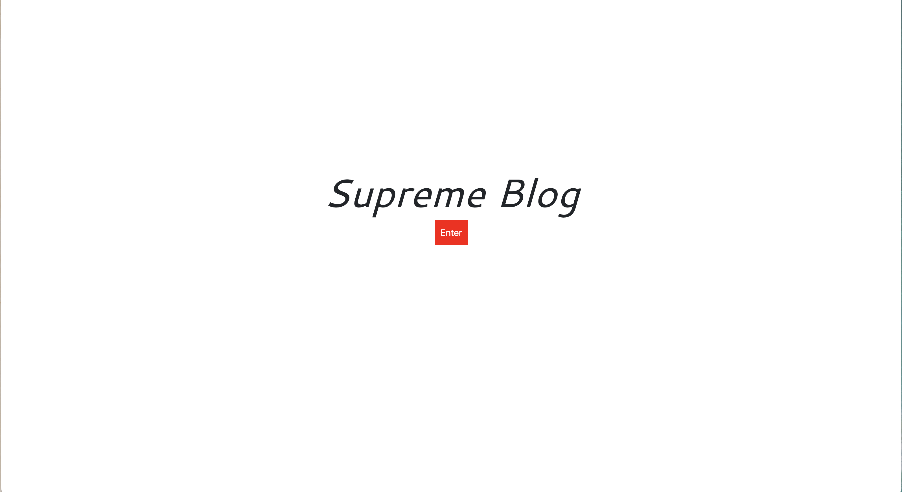

## 14 Model-View-Controller (MVC): Tech Blog
----------------------------
#### Description
- This application features a CMS-style blog where developers can log in and publish blog posts
- The application follows the MVC paradigm in its architectural structure, uses Handlebars.js as the templating language, Sequelize as the ORM, and the express-session npm package for authentication.

----------------------------
#### Table of Contents
- [Description](#description)
- [Installation](#installation)
- [Application](#application)
- [License](#license)
- [Contact](#contact)

----------------------------
#### Installation
- This application requires **Node.JS**
- To run application, first fill in neccessary information in **.env** file to connect to MySql
- Install necessary npm packages:
```md
    npm install || npm i
```
- Run schmea database in **db** folder:
```md
    mysql -u root -p
    source schema.sql
```
- Seed the database:
```md
    npm run seed
```
- Start application:
```md
    npm start || node server.js
```
----------------------------
#### Application



----------------------------
#### License


----------------------------
#### Contact
* Paul Won
    * github-repo: https://github.com/paulwon2223/MVC-TechBlog-PW
    * email: wonpaul2223@gmail.com
- Heroku Link: 